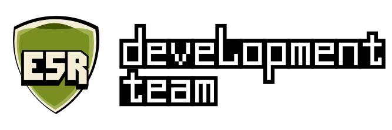
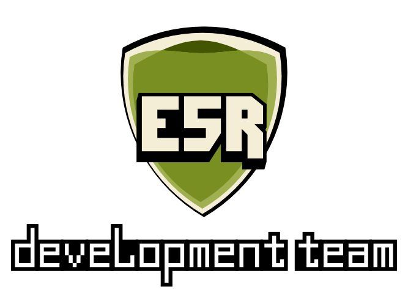
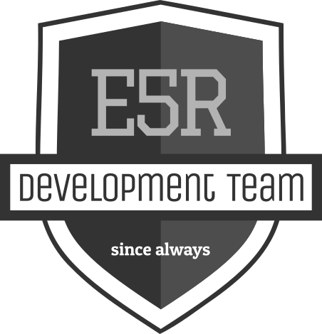
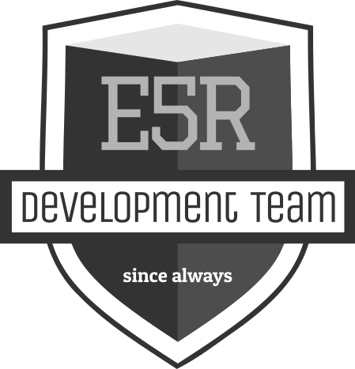

MIV - Manual de Identidade Visual
=================================

Manual de Interface Visual E5R.

# Proposta 1 -  Escudo

# Proposta 1 - Logo horizontal

# Proposta 2 - Logo vertical

## Proposta 2
   

## Proposta 3
   